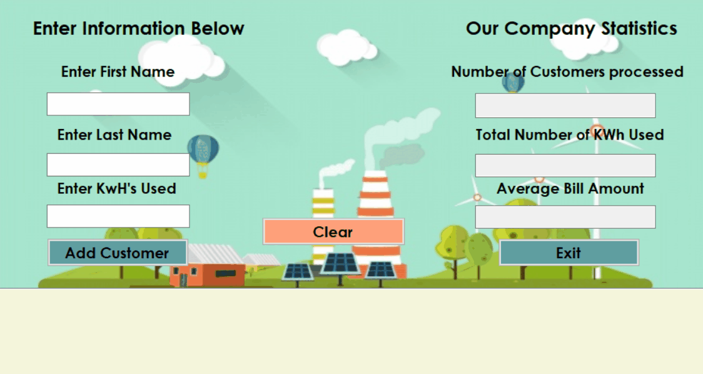

# Electrical-Bill-Processer

Project Description
I was asked to create an application that processes electricity bills for multiple customers. For now,
customers’ data will be just stored in the application. 
In other words, each time the application
executes, it will start from scratch.
For each customer, electricity bill is calculated based on number of kWh as follows:
• There is an administrative charge of $12.
• In addition, for each kWh used there a charge of $0.07.
For each customer, the following data is stored:
• AccountNo – an int value,
• FirstName and LastName – string values,
• Number of kWh used – a decimal number, and
• BillAmount – a decimal number.
The application will create and store multiple objects that contain customers’ data. It will also keep
track of the following statistics:
• Number of customers processed,
• Total number of kWh used,
• Average bill amount

